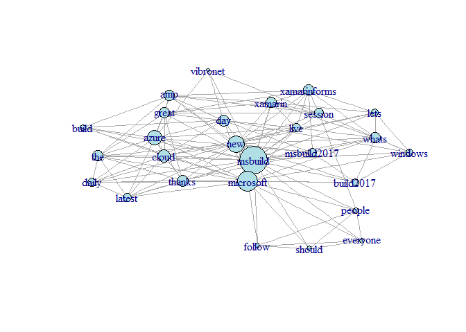

Data Collection and Network Analysis
================
Shaked & Assaf
May 2017

Centerality Measure (Question 1a)
=================================

### Load Graph

In order to be able to understand properly the relationships in "Grey's Anatomy", we'll load the data into a graph representation, which will also make it easier to explore some new information about the data easily.

``` r
ga.data <- read.csv('ga_edgelist.csv', header=T, stringsAsFactors=F)
ga.vrtx <- read.csv('ga_actors.csv', header=T, stringsAsFactors=F)
g <- graph.data.frame(ga.data, vertices=ga.vrtx, directed=F)
g
```

    ## IGRAPH UN-- 32 34 -- 
    ## + attr: name (v/c), gender (v/c)
    ## + edges (vertex names):
    ##  [1] lexi    --sloan        karev   --lexi         owen    --yang        
    ##  [4] altman  --owen         sloan   --torres       altman  --sloan       
    ##  [7] arizona --torres       karev   --torres       derek   --grey        
    ## [10] izzie   --karev        izzie   --o'malley     o'malley--torres      
    ## [13] colin   --yang         preston --yang         karev   --kepner      
    ## [16] addison --sloan        addison --karev        addison --derek       
    ## [19] nancy   --sloan        karev   --olivia       olivia  --o'malley    
    ## [22] grey    --o'malley     karev   --mrs. seabury adele   --chief       
    ## + ... omitted several edges

### Plot Graph

Now we see that we have an **undirected** graph, with **32 vertices** and **34 edges**.
Each vertex has information about the *name* of the person and his/her *gender*.
Let's plot the graph, while males are in blue and females are in pink:

``` r
V(g)$size <- 10 # Set size to all nodes
V(g)$color <- "powderblue"
females <- which(V(g)$gender == "F")
V(g)$color[females] <- "pink" 
plot(g)
```


### Largest Connectivity Component

We can see that we have **3** connectivity components. One of them is quite large, while the other two are smaller. Let's take out the largest one and plot it.

``` r
comp <- components(g, mode="strong")
largest_comp <- which.max(comp$csize)
g_lc <- induced.subgraph(g, V(g)[which(comp$membership == largest_comp)])
plot(g_lc)
```


Now We want to calculate the centrality of the largest connectivity component, based on three measures: *betweenness*, *closeness* and *eigenvector*.

### Betweeness

Betweenness measures how many times a vertex acts as a bridge in the shortest paths between each pair of vertices.
For each pair of vertices (S, T) that differ from X, we calculate the number of shortests paths between S and T that pass through X, divided by the number the number of shortests paths between S and T. Then, we sum it all the results and we get the betweenness of vertex X.
There is also a normalized form of this formula, which we used, where we divide the result in the number of all possible pairs (i.e. (N-1)(N-2)/2, where N is the number of vertices).

``` r
bw <- betweenness(g_lc, v = V(g_lc), directed=F, normalized=T)
bw <- sort(bw, decreasing=T)
bw
```

    ##        sloan        karev       altman       torres         owen 
    ##   0.45599473   0.37654809   0.30039526   0.26541502   0.23715415 
    ##     o'malley        izzie         grey      addison         yang 
    ##   0.21508564   0.18952569   0.18524374   0.17424242   0.16996047 
    ##         lexi        derek       olivia      arizona        avery 
    ##   0.14229249   0.07094862   0.01956522   0.00000000   0.00000000 
    ##        colin        denny         finn         hank       kepner 
    ##   0.00000000   0.00000000   0.00000000   0.00000000   0.00000000 
    ## mrs. seabury        nancy      preston        steve 
    ##   0.00000000   0.00000000   0.00000000   0.00000000

We can see that in this measure *sloan*, *karev* and *altman* have the largest betweeness centrality.

### Closeness

Closeness measures how close a vertex to all other vertices.
It is calculated using the following formula:
$$C(X) = \\frac{1}{\\sum\_{Y \\in V} d(X,Y)}$$
 where d(x,y) is the length of the shortest path between vertex X and vertex Y. We will use the normalized form of this formula, which look like this (N - num of vertices):
$$C(X) = \\frac{N-1}{\\sum\_{Y \\in V} d(X,Y)}$$

``` r
cl <- closeness(g_lc, vids = V(g_lc), normalized=T)
cl <- sort(cl, decreasing=T)
cl
```

    ##       torres      addison        karev        sloan     o'malley 
    ##    0.4035088    0.3898305    0.3898305    0.3898305    0.3650794 
    ##         lexi        izzie       altman        derek       olivia 
    ##    0.3538462    0.3333333    0.3150685    0.3150685    0.3150685 
    ##         grey      arizona       kepner mrs. seabury        nancy 
    ##    0.2987013    0.2911392    0.2839506    0.2839506    0.2839506 
    ##        avery         owen        denny         hank         finn 
    ##    0.2643678    0.2584270    0.2527473    0.2527473    0.2323232 
    ##        steve         yang        colin      preston 
    ##    0.2323232    0.2149533    0.1782946    0.1782946

We can see that in this measure *torres*, *addison* and *karev* have the largest closeness centrality.

### Eigenvector

Eigenvector measures the influence of a vertex in a graph.
In this measure, how central a vertex is depends on how central its neighbors are. It is calculated as the sum of weights of all neighbors of X, multiplied by a contant.

``` r
ec <- eigen_centrality(g_lc, directed=F, scale=F)
ec <- sort(ec$vector, decreasing=T)
ec
```

    ##        karev       torres        sloan     o'malley        izzie 
    ##   0.50276879   0.36092629   0.32268309   0.30201197   0.28426339 
    ##      addison         lexi       olivia         grey mrs. seabury 
    ##   0.27840140   0.26424553   0.23555685   0.15107836   0.14715888 
    ##       kepner        derek      arizona       altman        nancy 
    ##   0.14715888   0.12570740   0.10564202   0.10442628   0.09444835 
    ##        denny         hank        avery         finn        steve 
    ##   0.08320302   0.08320302   0.07734385   0.04422017   0.04422017 
    ##         owen         yang        colin      preston 
    ##   0.03408964   0.01204109   0.00352439   0.00352439

We can see that in this measure *karev*, *torres* and *sloan* have the largest eigenvector centrality.

Communities (Question 1b)
=========================

Girvan-Newman (Edge Betweenness) Clustering
-------------------------------------------

Girvan-Newman is a hierarchical method that uses a TOP-DOWN approach, for finding communities in a graph, using edge betweenness.
It is based on the idea of vertex betweenness, but this time for edges. That means, edge betweenness measures the number of shortests paths that passing on an **edge**.
The algorithm calculates edge betweenness for the edges and then removes the edges with the highest betweenness, repeatedly, until there are no edges.

``` r
set.seed(123)
gn <- cluster_edge_betweenness(g, directed=F)
gn
```

    ## IGRAPH clustering edge betweenness, groups: 7, mod: 0.58
    ## + groups:
    ##   $`1`
    ##   [1] "addison"      "avery"        "karev"        "kepner"      
    ##   [5] "lexi"         "mrs. seabury" "nancy"        "sloan"       
    ##   
    ##   $`2`
    ##   [1] "adele"       "chief"       "ellis grey"  "susan grey"  "thatch grey"
    ##   
    ##   $`3`
    ##   [1] "altman"  "colin"   "owen"    "preston" "yang"   
    ##   
    ##   + ... omitted several groups/vertices

### Paint Graph by Communities

Now we will plot the graph, while painting each community in a unique color.

``` r
gn_colors <- membership(gn)
plot(g, vertex.size=10, vertex.color=gn_colors, asp=F)
```


### Communities

First, we will check how many communities we got.

``` r
gn_clusters <- length(gn)
gn_clusters
```

    ## [1] 7

OK. So we know we have **7** communities. Now, we will find what is the size of each community.

``` r
gn_communities_size <- c()
for(i in 1:gn_clusters){
  gn_communities_size <- c(gn_communities_size, length(gn[[i]]))
}
gn_communities_size
```

    ## [1] 8 5 5 4 3 3 4

We can see that the communities sizes are **8, 5, 5, 4, 3, 3 and 4**.

### Modularity Score

Now, we want to see the modularity score of **Girvan-Newman** communities algorithm, which will tell us the network was partitioned into communities.
The modularity score is:

``` r
max(gn$modularity)
```

    ## [1] 0.5774221

And the number of partitions that was made to get this modularity score is:

``` r
which.max(gn$modularity)
```

    ## [1] 26

Louvain Clustering
------------------

Louvain Clustering is a hierarchial approach that uses a BOTTOM-UP approace for finding communities in a graph. It is a greedy algorithm.
The algorithm works as follows:
Initially, each vertex is assigned to a community on its own.
In each iteration, each vertex is moved to the community which achieves the highest contribution to modularity. When no vertices can be reassigned, each community becomes a vertex and the process repeats. The alogrithms stops when there is only one vertex or when
the modularity cannot be increased anymore.

``` r
set.seed(123)
le <- cluster_louvain(g)
le
```

    ## IGRAPH clustering multi level, groups: 6, mod: 0.59
    ## + groups:
    ##   $`1`
    ##   [1] "bailey" "ben"    "tucker"
    ##   
    ##   $`2`
    ##   [1] "addison" "derek"   "finn"    "grey"    "steve"  
    ##   
    ##   $`3`
    ##   [1] "avery" "lexi"  "nancy" "sloan"
    ##   
    ##   $`4`
    ##   + ... omitted several groups/vertices

### Paint Graph by Communities

Now we will plot the graph, while painting each community in a unique color.

``` r
le_colors <- membership(le)
plot(g, vertex.size=10, vertex.color=le_colors, asp=FALSE)
```


### Communities

First, we'll want to check how many communities we got.

``` r
le_clusters <- length(le)
le_clusters
```

    ## [1] 6

OK. So we know we have **6** communities. Now, we will find what is the size of each community.

``` r
le_communities_size <- c()
for(i in 1:le_clusters){
  le_communities_size <- c(le_communities_size, length(le[[i]]))
}
le_communities_size
```

    ## [1]  3  5  4  5 10  5

We can see that the communities sizes are **3, 5, 4, 5, 10 and 5**.

### Modularity Score

Now, we want to see the modularity score of **Louvain** communities algorithm, which will tell us the network was partitioned into communities.
The modularity score is:

``` r
max(le$modularity)
```

    ## [1] 0.5947232

And the number of partitions that was made to get this modularity score is:

``` r
which.max(le$modularity)
```

    ## [1] 2

Network Analysis (Question 2)
=============================

In this part of the assignment, we are going to perform social network analysis to tweet content that were posted in the popular social network - **Twitter**.
We will find the frequent words that appeared in tweets that contains a certain hash-tag, and see which ones appeared together in the same tweet.
Using this analysis we can get more info about the connections between certain words.

### Setting Twitter OAuth Credentials

First, we need to set up our Twitter OAuth credentials, so we would be able to download the tweets data using the API.

``` r
consumer_key <- "DNn8CHvzQoKeJpIotKj91CDjP"
consumer_secret <- "vdBVVZnBMYnugQiLq4d0IiqYnkqPK0YhO0MwDuw9Ph8sUdZdX7"
access_token <- "769590451-QmB6viAW6hag3H8ezRSKIwtASKQZwBWjnjXz4vBQ"
access_secret <- "KF1XP4LN6YhEbrLA2VXGU4D2tiGWl3Or6kL27I6VPem9d"
sig <- setup_twitter_oauth(consumer_key, consumer_secret, access_token, access_secret)
```

    ## [1] "Using direct authentication"

### Download Tweets

Now, we are going to download tweets using *twitteR* package.
We will get the latest tweets that contains the hashtag **MSBuild**, which relates to the latest Microsoft Build conference, and that are written in english.
Dates are entered for reproducablity (as much as possible).

``` r
search_res <- searchTwitter("#MSBuild", n=1000, lang="en", 
                            since="2017-05-01", until="2017-05-12")
```

### Data Preprocessing

Now that we have the data, we want to filter it and use only the relevant data for our social network analysis.
We will perform our data cleaning using the following steps:
1. Extract the text of the tweet.
2. Remove all retweets (to avoid duplications).
3. Remove graphical characters from each tweet (such as emojis).
4. Remove punctuations from each tweet.
5. Remove stop words from each tweet.

``` r
search_text <- sapply(search_res, function(x) x$getText())
search_text <- search_text[!grepl("RT ", search_text)]
search_text <- sapply(search_text, function(x) str_replace_all(x, "[^[:graph:]]", " "))
search_text <- sapply(search_text, removePunctuation)
search_text <- sapply(search_text, function(x) removeWords(x, stopwords('english')))
```

Now, we will create a *TermDocumentMatrix* object, that performs term frequency analysis in each tweet. This time a tween is considered a document.

``` r
search_text_corpus <- Corpus(VectorSource(search_text))
tdm <- TermDocumentMatrix(search_text_corpus)
```

Using our *TermDocumentMatrix*, we will extract the terms that have more than **10** occurrences in our tweets.

``` r
term_freq = findFreqTerms(tdm, lowfreq = 10)
term_freq
```

    ##  [1] "msbuild"      "windows"      "latest"       "the"         
    ##  [5] "daily"        "xamarinforms" "great"        "session"     
    ##  [9] "xamarin"      "whats"        "everyone"     "follow"      
    ## [13] "microsoft"    "people"       "should"       "thanks"      
    ## [17] "new"          "build2017"    "day"          "live"        
    ## [21] "lets"         "cloud"        "azure"        "vibronet"    
    ## [25] "msbuild2017"  "amp"          "build"

Now, we will create a new *weighted* adjacency matrix to the frequent words we found, using our term frequency matrix.
To do so, we will first filter only these terms, then we will make the frequency binary and then create a new term-term matrix, using matrix multiplication of our matrix and its transposed matrix.
This is a part of the adjacency matrix:

``` r
tdm_freq <- tdm[term_freq,]
tdm_freq[tdm_freq > 1] <- 1
tdm_freq <- as.matrix(tdm_freq)
tm <- tdm_freq %*% t(tdm_freq)
tm[1:9,1:9]
```

    ##               Terms
    ## Terms          msbuild windows latest the daily xamarinforms great session
    ##   msbuild          247      20     40  45    32           20    11       9
    ##   windows           20      20      0   0     0            0     0       1
    ##   latest            40       0     40  39    31            0     0       0
    ##   the               45       0     39  45    32            0     2       0
    ##   daily             32       0     31  32    32            0     0       0
    ##   xamarinforms      20       0      0   0     0           20     1       2
    ##   great             11       0      0   2     0            1    11       1
    ##   session            9       1      0   0     0            2     1       9
    ##   xamarin           10       0      0   0     0            5     1       2
    ##               Terms
    ## Terms          xamarin
    ##   msbuild           10
    ##   windows            0
    ##   latest             0
    ##   the                0
    ##   daily              0
    ##   xamarinforms       5
    ##   great              1
    ##   session            2
    ##   xamarin           10

### Graph Creation

With the adjacenct matrix we created before, we will now create a weighted undirected graph, to display our data. In this case, the terms will be the vertices of our graph and the edges will be between each two vertices that theirs terms where appearing together in the same tweet. Hence, The weights will be the number of tweets where the two terms appeared together. In order to simplify the graph we will remove self edges from the graph, and in order to demonstrate the significance of each term, we will make the size of the node proportional to its degree.

``` r
g1 = graph.adjacency(tm, weighted=T, mode="undirected")
g1 <- simplify(g1)
V(g1)$size <- degree(g1)/1.5
V(g1)$color <- "powderblue"
plot(g1, layout=layout.fruchterman.reingold, asp=F)
```



### Calculate Centrality

Now, we want to calculate betweenness, closeness and eigenvector centralities to our new graph, in order to see how important and how significant each vertex is to the graph.
In every result, the centrality values are sorted from the highest to the lowest.

#### Betweenness

``` r
bw <- betweenness(g1, v = V(g1), directed=F, normalized=T, weights=E(g1)$weight)
bw <- sort(bw, decreasing=T)
bw
```

    ##    microsoft      session        great          new  msbuild2017 
    ##  0.199089133  0.167384615  0.127599512  0.126062271  0.111345543 
    ##        azure        cloud       thanks          day       people 
    ##  0.099728938  0.093571429  0.080202686  0.053435897  0.037692308 
    ##        whats         lets      xamarin       latest        daily 
    ##  0.034461538  0.027092796  0.026954823  0.021349206  0.021349206 
    ## xamarinforms          amp          the     vibronet         live 
    ##  0.012529915  0.008271062  0.007393162  0.005709402  0.003726496 
    ##      windows    build2017      msbuild     everyone       follow 
    ##  0.003076923  0.002735043  0.000000000  0.000000000  0.000000000 
    ##       should        build 
    ##  0.000000000  0.000000000

#### Closeness

``` r
cl <- closeness(g1, vids = V(g1), normalized=T, weights=E(g1)$weight)
cl <- sort(cl, decreasing=T)
cl
```

    ##       thanks        great          new        azure        cloud 
    ##   0.32098765   0.31707317   0.31707317   0.30952381   0.30588235 
    ##       latest        daily      session    microsoft  msbuild2017 
    ##   0.30232558   0.30232558   0.30232558   0.29885057   0.29885057 
    ##          the      xamarin          day        whats    build2017 
    ##   0.28571429   0.28571429   0.28571429   0.28260870   0.28260870 
    ##         lets          amp xamarinforms         live     vibronet 
    ##   0.27956989   0.27659574   0.26804124   0.26530612   0.25490196 
    ##       people        build      windows      msbuild     everyone 
    ##   0.24761905   0.24528302   0.24299065   0.11206897   0.08695652 
    ##       follow       should 
    ##   0.08695652   0.08695652

#### Eigenvector

``` r
ec <- eigen_centrality(g1, directed=F, scale=F, weights=E(g1)$weight)
ec <- sort(ec$vector, decreasing=T)
ec
```

    ##      msbuild          the       latest        daily       thanks 
    ##   0.54863635   0.42361456   0.40528724   0.35252716   0.34430928 
    ##    microsoft          new xamarinforms      windows          day 
    ##   0.16494700   0.10397285   0.08878780   0.08408987   0.08154458 
    ##        cloud        azure       people        whats     everyone 
    ##   0.07799768   0.07299509   0.06475573   0.06455509   0.06102285 
    ##       follow       should         lets          amp        great 
    ##   0.06102285   0.06102285   0.05646340   0.05406913   0.05210750 
    ##         live      xamarin    build2017        build     vibronet 
    ##   0.05074577   0.04699076   0.04694808   0.04352882   0.03998246 
    ##      session  msbuild2017 
    ##   0.03947534   0.03217607

### Clustering

### Girvan-Newman (Edge Betweenness) Clustering

Girvan-Newman is a hierarchical method that uses a TOP-DOWN approach, for finding communities in a graph, using edge betweenness.
It is based on the idea of vertex betweenness, but this time for edges. That means, edge betweenness measures the number of shortests paths that passing on an **edge**.
The algorithm calculates edge betweenness for the edges and then removes the edges with the highest betweenness, repeatedly, until there are no edges.

``` r
set.seed(123)
gn <- cluster_edge_betweenness(g1, directed=F, weights=E(g1)$weight)
gn
```

    ## IGRAPH clustering edge betweenness, groups: 7, mod: 0.11
    ## + groups:
    ##   $`1`
    ##   [1] "msbuild"   "everyone"  "follow"    "microsoft" "people"   
    ##   [6] "should"   
    ##   
    ##   $`2`
    ##   [1] "windows" "xamarin" "whats"   "lets"   
    ##   
    ##   $`3`
    ##   [1] "latest" "the"    "daily"  "great"  "thanks" "new"    "cloud" 
    ##   [8] "azure"  "amp"   
    ##   + ... omitted several groups/vertices

#### Paint Graph by Communities

Now we will plot the graph, while painting each community in a unique color.

``` r
gn_colors <- membership(gn)
plot(g1, vertex.size=10, vertex.color=gn_colors, asp=F)
```


#### Communities

First, we will check how many communities we got.

``` r
gn_clusters <- length(gn)
gn_clusters
```

    ## [1] 7

OK. So we know we have **7** communities. Now, we will find what is the size of each community.

``` r
gn_communities_size <- c()
for(i in 1:gn_clusters){
  gn_communities_size <- c(gn_communities_size, length(gn[[i]]))
}
gn_communities_size
```

    ## [1] 6 4 9 4 2 1 1

We can see that the communities sizes are **6, 4, 9, 4, 2, 1 and 1**.

#### Modularity Score

Now, we want to see the modularity score of **Girvan-Newman** communities algorithm, which will tell us the network was partitioned into communities.
The modularity score is:

``` r
max(gn$modularity)
```

    ## [1] 0.105439

And the number of partitions that was made to get this modularity score is:

``` r
which.max(gn$modularity)
```

    ## [1] 21

### Louvain Clustering

Louvain Clustering is a hierarchial approach that uses a BOTTOM-UP approace for finding communities in a graph. It is a greedy algorithm.
The algorithm works as follows:
Initially, each vertex is assigned to a community on its own.
In each iteration, each vertex is moved to the community which achieves the highest contribution to modularity. When no vertices can be reassigned, each community becomes a vertex and the process repeats. The alogrithms stops when there is only one vertex or when the modularity cannot be increased anymore.

``` r
set.seed(123)
le <- cluster_louvain(g1)
le
```

    ## IGRAPH clustering multi level, groups: 3, mod: 0.3
    ## + groups:
    ##   $`1`
    ##   [1] "latest" "the"    "daily"  "thanks"
    ##   
    ##   $`2`
    ##    [1] "msbuild"      "windows"      "xamarinforms" "great"       
    ##    [5] "session"      "xamarin"      "whats"        "new"         
    ##    [9] "build2017"    "day"          "live"         "lets"        
    ##   [13] "cloud"        "azure"        "vibronet"     "msbuild2017" 
    ##   [17] "amp"          "build"       
    ##   
    ##   + ... omitted several groups/vertices

#### Paint Graph by Communities

Now we will plot the graph, while painting each community in a unique color.

``` r
le_colors <- membership(le)
plot(g1, vertex.size=10, vertex.color=le_colors, asp=FALSE)
```


#### Communities

First, we'll want to check how many communities we got.

``` r
le_clusters <- length(le)
le_clusters
```

    ## [1] 3

OK. So we know we have **3** communities. Now, we will find what is the size of each community.

``` r
le_communities_size <- c()
for(i in 1:le_clusters){
  le_communities_size <- c(le_communities_size, length(le[[i]]))
}
le_communities_size
```

    ## [1]  4 18  5

We can see that the communities sizes are **4, 18 and 5**.

#### Modularity Score

Now, we want to see the modularity score of **Louvain** communities algorithm, which will tell us the network was partitioned into communities.
The modularity score is:

``` r
max(le$modularity)
```

    ## [1] 0.2955374

And the number of partitions that was made to get this modularity score is:

``` r
which.max(le$modularity)
```

    ## [1] 2
